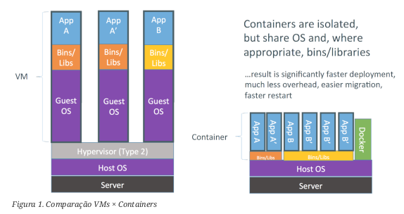
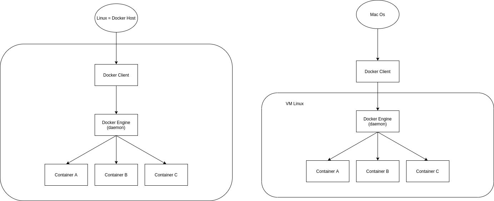

# Curso Docker

# Conceitos

## O que é docker

Diferentemente da virtualização tradicional, baseada em [VM](https://pt.wikipedia.org/wiki/M%C3%A1quina_virtual), o Docker  é uma engine de administração de containers que usa na virtualização baseada em software, podendo esses containers, serem empacotados em vários níveis de isolamento.

Alguns isolamentos possíveis:

- Limites de uso de memória
- Limites de uso de CPU
- Limites de uso de I/O
- Limites de uso de rede
- Isolamento da rede (que redes e portas são acessíveis)
- Isolamento do file system
- Permissões e Políticas
- Capacidades do kernel

Um container é um processo segregado do SO, que a partir dele, pode-se iniciar aplicações de forma isolada ao SO. Além disso, existe também um sistema de arquivos completo, para que a partir do do processo e do sistema de arquivos separado, possa ser executado um software em um ambiente o mais controlado possível.

Diferente das VMs, alguns recursos são compartilhados com a máquina host (ex: kernel). O que faz com que um container tenha a necessidade de memória e processamento muito menor que uma VM.

O Docker se baseia em uma tecnologia chamada de LXC (Linux Containers), ou seja, os containers devem rodar sistemas operacionais baseados em Linux (Debian, Ubuntu, Fedora, etc).

É uma tecnologia open source e escrita em GO. 

Os containers do docker tendem a usar menos recursos que uma máquina virtual.



- Limitações dos containers:
    - Todas as imagens são apenas baseadas em Linux;
    - Não é possível usar um kernel diferente do que o Host.

## Containers e Imagens

Container é a segregação de processos no mesmo kernel, isolando ele o máximo possível de todo o ambiente. São File Systems, criados a partir de uma imagem e que também podem possuir características próprias.

### Características dos containers

- Segregação de processos no mesmo kernel
- Sistemas de arquivos criados a partir de uma imagem
- Ambientes leves e portáteis no qual aplicações são executadas
- Encapsula todos os binários e bibliotecas necessárias para a execução de um app.
- Algo entre um chroot e uma VM.

Imagens é a materialização de um modelo de sistema de arquivos produzidos através de um processo de build. Estas imagens podem ser representadas por um ou mais arquivos e pode também ser armazenada em um repositório. 

### Características das imagens

- Modelo de sistema de arquivo somente-leitura usado para criar containers
- Imagens são criadas através de um processo chamado build
- São armazenadas em repositórios Registry
- São compostas por uma ou mais camadas
- Uma camada também pode ser chamada de imagens intermediárias
- A junção dessas camadas formam a imagem
- Apenas a ultima camada pode ser alterada quando o container for iniciado
- [AUFS](https://pt.wikipedia.org/wiki/Aufs) (Advanced Multi-Layered Unification FileSystem) é muito usado
- O grande objetivo dessa estratégia de dividir uma imagem em camadas é o reuso
- É possível compor imagens a partir de camadas de outras imagens

# Arquitetura


O uso básico do Docker consiste em:

- Ter o serviço *Docker Engine* rodando;
- Ter acesso a *Api Rest* do *Docker Engine*, normalmente através do *Docker Client*;
- Baixar uma imagem do *Docker Registry* - geralment, pelo Dockerhub, que é o repositório oficial;
- Instanciar um container a partir de uma imagem baixada.



No Windows 10 (mais antigos) ou Windows 7 e 8, a instalação será igual ao Mac OS (com uma VM Linux, onde fica o Docker Daemon). Caso o Windows possua o [WSL](https://docs.microsoft.com/pt-br/windows/wsl/about), a instalação será semelhante à instalação no Linux.

O *Docker Engine* expõe uma Api Rest que pode ser consultada por várias ferramentas uma delas é o *Docker Client*, um utilitário de linha de comando

# Instalação do Docker

## Windows

[Leia a documentação aqui](https://docs.docker.com/desktop/windows/install/)

## Linux

- [Docker](https://www.digitalocean.com/community/tutorials/how-to-install-and-use-docker-on-ubuntu-20-04)
- [Docker-Compose](https://www.digitalocean.com/community/tutorials/how-to-install-and-use-docker-compose-on-ubuntu-20-04)

# MacOS

[Leia a documentação aqui](https://docs.docker.com/desktop/mac/install/)

# Comandos Docker

## Comando `run`

```bash
# Passo para a verificação da instalação do Docker, para ver o correto
# funcionamento do Docker incluindo a recuperação de imagens e execução 
# de containers

docker container run hello-world
```

O comando `docker run` agrupa diversas funções básicas, tais como:

- Download automático das imagens não encontradas: `docker image pull`
- Criação do container: `docker container create`
- Execução do container: `docker container start`
- Uso do modo iterativo: `docker container exec`

```bash
# --rm: Executa todos os passos do comando 'run' 
# e remove o container após a execuação

docker container run **--rm** <imagem>
```

O comando run **sempre** cria novos containers

```bash
# Executando um container e acessando o mesmo

docker run **-it** <imagem>
# i = modo interativo
# t = acesso ao terminal
```

Para nomear um container basta usar a flag `--name` e passar o nome do container

```bash
docker container run --name <nome> <imagem>
```

## Reutilizando containers

```bash
docker container start **-ai** <nome>

# a: "anexa" o terminal do container (attach)
# i: modo interativo
```

## Mapeando portas

```bash
docker container run -p <porta exposta pelo host>:<porta exposta pelo container> <imagem>
```

## Mapeamento de volumes do host para o container

```bash
docker container run -v <local host>:<local container> <imagem>
```

## Rodando um container em background

```bash
docker container **-d** <imagem>
```

## Manipulação de containers

- `docker container start` — Inicia
- `docker container restart` — Reinicia
- `docker container stop` — Para
- `docker container ls` — Lista
- `docker container logs` — Mostra todos os logs
- `docker container inspect` — Mostra todos os dados do container
- `docker container exec <container> <comando>` — Executa um comando dentro do container

Obs: Pode-se ser usado o nome do container ou seu id.

## Manipulação de imagens

- `docker image pull` — Baixa imagem do repositório
- `docker image ls` — Lista as imagens
- `docker image rm` — Remove as imagens
- `docker image inspect` — Lista as informações da imagem
    - É possível filtra o resultado usando a flag `--format=<filtro>`
- `docker image tag` — Gera uma tag da imagem
- `docker image build` — Converte um dockerfile em uma imagem
- `docker image push` — Envia uma imagem para o [registry](https://imasters.com.br/docker/docker-registry-entendendo-melhor)

# Fazer o build de uma imagem

Cria-se toda a configuração necessária no arquivo descritor (ou Dockerfile), no diretório onde se encontra o Dockerfile, deve-se rodar o seguinte comando:

```jsx
docker image build -t <imagem> .

# -t gera uma nova tag
# . é o diretorio onde está o dockerfile
```

## Fazer o build com argumentos

No Dockerfile, usar a seguinte instrução

```docker
ENV NOME_VAR=${NOME_VAR}
```

Ao fazer o build:

```bash
docker image build --build-arg <VAR>=<valor> -t <imagem> <local>
```

## Copiar arquivos para a imagem

Usa-se o comando `COPY <arquivo> <image>` no dockerfile

```bash
docker image run -it --volumes-from=<container> <image>
```

Gera um container capaz de acessar os volumes de outro container.

# Instruções do Dockerfile

- `FROM` Especifica a imagem base a ser utilizada pela nova imagem.
- `LABEL` Especifica vários metadados para a imagem como o mantenedor. A especificação do mantenedor era feita usando a instrução específica, MAINTAINER que foi substituída pelo LABEL.
- `ENV` Especifica variáveis de ambiente a serem utilizadas durante o build.
- `ARG` Define argumentos que poderão ser informados ao build através do parâmetro --build-arg.
- `COPY` Copia arquivos e diretórios para dentro da imagem.
- `ADD` Similar ao anterior, mas com suporte extendido a URLs. Somente deve ser usado nos casos que a instrução COPY não atenda.
- `RUN` Executa ações/comandos durante o build dentro da imagem.
- `EXPOSE` Informa ao Docker que a imagem expõe determinadas portas remapeadas no container. A exposição da porta não é obrigatória a partir do uso do recurso de redes internas do Docker. Recurso que veremos em Coordenando múltiplos containers. Porém a exposição não só ajuda a documentar como permite o mapeamento rápido através do parâmetro -P do docker container run.
- `WORKDIR` Indica o diretório em que o processo principal será executado.
- `ENTRYPOINT` Especifica o processo inicial do container.
- `CMD` Indica parâmetros para o ENTRYPOINT.
- `USER` Especifica qual o usuário que será usado para execução do processo no container (ENTRYPOINT e CMD) e instruções RUN durante o build.
- `VOLUME` Instrui a execução do container a criar um volume para um diretório indicado e copia todo o conteúdo do diretório na imagem para o volume criado. Isto simplificará no futuro, processos de compartilhamento destes dados para backup por exemplo

## Exemplo de Dockerfile

```docker
FROM python:3.6
LABEL maintainer 'Juracy Filho <juracy at gmail.com>'
RUN useradd www && \
mkdir /app && \
mkdir /log && \
chown www /log
USER www
VOLUME /log
WORKDIR /app
EXPOSE 8000
ENTRYPOINT ["/usr/local/bin/python"]
CMD ["run.py"]
```

# Redes no Docker

O Docker possui 4 modelos de redes: none, bridge, host e overlay, o modelo padrão de redes no docker é o Bridge.

No modelo Nome Network, não existe acesso a rede.

No modelo Bridge Network, o docker atua como uma "ponte" entre as interfaces de redes entre o container e o host.

No modelo Host Network, existe o acesso direto às interfaces de rede do host.

No modelo Overlay Network é disponível no [Swarm mode](https://docs.docker.com/engine/swarm/).

## None Network

- Containers sem acesso entre si e nem com o mundo exterior, só acessível pelo terminal
- Recomendado par containers que não precisam de acesso a rede
- Criando um container: `docker container run --net none <imagem>`

## Bridge Network

- Cada container possui a sua própria interface de rede, mas o modo bridge faz com que tenha uma comada de isolamento entre a rede do host com a rede dos containers
- Para ver informações sobre a rede: `docker network inspect <rede>`
- Criar uma nova rede: `docker network create --driver <tipo> <nome>`
- Por padrão, os containers de uma rede, não tem acesso as demais redes, para isso é necessário o seguinte comando: `docker network connect <rede> <container>`
- Para desconetar: `docker network disconect <rede> <container>`

## Host Network

- Não existe uma ponte entre as interfaces de rede da máquina host e as interfaces do container

# Docker Compose

O docker-compose é uma ferramenta de orquestração de containers. A partir de um arquivo yaml, chamado docker-compose.yaml é possível definir uma estrutura para um ou vários containers.

Para usar o docker-compose, são necessários apenas 3 passos:

1. Defina o ambiente do seu aplicativo com um Dockerfile para que possa ser reproduzido em qualquer lugar. 
2. Defina os serviços que compõem seu aplicativo em docker-compose.yml para que possam ser executados juntos em um ambiente isolado.
3. Execute `docker compose up` e o comando Docker compose iniciará e executará todo o seu aplicativo. Como alternativa, você pode executar `docker-compose up` usando o binário docker-compose.

Além disso, docker-compose também possui comandos para o gerenciamento de todo o ciclo de vida da aplicação:

- Iniciar, parar e reconstruir serviços
- Ver o status dos serviços em execução
- Transmita a saída de registro de serviços em execução
- Executar um comando único em um serviço

## Principais Recursos

- [Vários ambientes isolados em um único host](https://docs.docker.com/compose/#multiple-isolated-environments-on-a-single-host)
- [Preserve os dados de volume quando os contêineres são criados](https://docs.docker.com/compose/#preserve-volume-data-when-containers-are-created)
- [Recrie apenas os contêineres que mudaram](https://docs.docker.com/compose/#only-recreate-containers-that-have-changed)
- [Variáveis e movimentação de uma composição entre ambientes](https://docs.docker.com/compose/#variables-and-moving-a-composition-between-environments)

## Principais Comandos do Docker-Compose

- `docker-compose up`: cria e inicia os contêineres;
- `docker-compose build`: realiza apenas a etapa de build das imagens que serão utilizadas;
- `docker-compose logs`: visualiza os logs dos contêineres;
- `docker-compose restart`: reinicia os contêineres;
- `docker-compose ps`: lista os contêineres;
- `docker-compose scale`: permite aumentar o número de réplicas de um contêiner;
- `docker-compose start`: inicia os contêineres;
- `docker-compose stop`: paralisa os contêineres;
- `docker-compose down`: paralisa e remove todos os contêineres e seus componentes como rede, imagem e volume.

# Estrutura do Arquivo

```yaml
version: '3.8'

networks:
  web_network:
    driver: overlay

volumes:
  site_conf:

services:
  web-server:
    image: httpd:latest
    ports: "80:80"
    deploy:
      placement:
        constraints:
          - "node.role==worker"
      mode: replicated
      replicas: 2
      resource:
        cpus: "0.50"
        memory: 256M
    restart: always
    networks:
      - web_network
    volumes:
      - /dir/site/html:/var/www/html
      - site_conf:/etc/httpd
```

- **services:** o Docker Compose trata todos os contêineres que  como serviços e é dessa forma que deve referenciá-los no arquivo de configuração.
- **build e image:** qual imagem de contêiner deve ser utilizada para a construção do contêiner.
- **ports e expose:** portas que serão utilizadas para acessar os serviços providos dentro do contêiner
- **deploy:** regras para a execução do serviço
- **restart e restart_policy:** definir o comportamento desejado em caso de queda do container. Na opção **restart** temos os seguintes argumentos que podem ser utilizados para definir o comportamento:
    - **no**: caso o contêiner saia do estado de execução, o compose não tentará executá-lo novamente;
    - **always**: utilizada para que sempre que o contêiner sair do estado de execução, independentemente da causa, o Compose execute-o novamente;
    - **on-failure**: irá tentar executar o contêiner novamente somente caso o código de retorno resulte em uma falha;
    - **unless-stopped**: sempre irá garantir que o estado do contêiner seja *em execução*, ao menos que este seja colocado em estado *stopped* manualmente ou por algum outro motivo;
- **networks:** define as redes que deverão ser criadas para que os serviços dela façam parte.
- volumes: volumes que desejamos criar e referenciar estes depois dentro de cada serviço que irá utilizá-lo.
- **environment:** passa em formato de lista todas as variáveis de ambiente e seus valores que serão utilizadas no serviço
- **env_file:** informar um arquivo que será utilizado como fonte de consulta para configurar as variáveis e este arquivo deve conter uma variável por linha e seu respectivo valor
- **command e entrypoint:** altera o processo principal responsável pela execução e função daquele contêiner. Ambos substituem o parâmetro CMD e ENTRYPOINT padrão da imagem utilizada.

# Fontes

**Overview of Docker Compose**. Docker Documentation. Disponível em: <https://docs.docker.com/compose/#features>. Acesso em: 1 Oct. 2021.

**Docker Compose: O que é? Para que serve? O que come? - iMasters - We are Developers**. iMasters - We are Developers. Disponível em: <https://imasters.com.br/banco-de-dados/docker-compose-o-que-e-para-que-serve-o-que-come>. Acesso em: 1 Oct. 2021.

‌CAEIRO, Ricardo. **Docker Compose - Explicado - Blog 4Linux**. Blog 4Linux. Disponível em: <https://blog.4linux.com.br/docker-compose-explicado/>. Acesso em: 1 Oct. 2021.

‌**Docker: Ferramenta essencial para Desenvolvedores**. Cod3r. Disponível em: <https://www.cod3r.com.br/courses/docker>. Acesso em: 1 Oct. 2021.